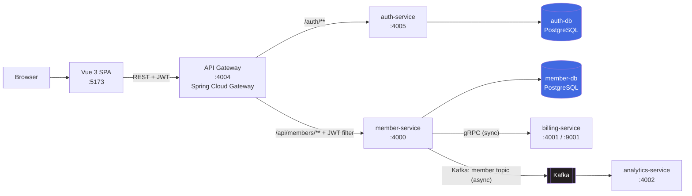
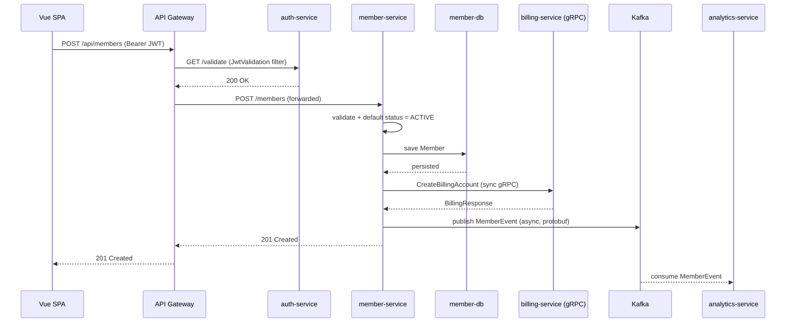

# Ironsmith — Gym Membership Management System

[](java-spring-microservices)
[](java-spring-microservices)
[](java-spring-microservices/api-gateway)
[](java-spring-microservices/billing-service)
[](java-spring-microservices/analytics-service)
[](java-spring-microservices/docker-compose.yml)
[](java-spring-microservices/docker-compose.yml)
[](java-spring-microservices/infrastructure)
[](gym-manager-frontend)
[](gym-manager-frontend)
[](gym-manager-frontend)
[](gym-manager-frontend)

An event-driven microservices platform for managing gym members and their
membership plans. A Vue 3 admin console talks to a Spring Cloud Gateway,
which fronts five independent Spring Boot services communicating over REST,
**gRPC**, and **Kafka** — with database-per-service PostgreSQL and an AWS CDK
stack that deploys the whole system to ECS Fargate behind an ALB.

Built to demonstrate: service decomposition, polyglot inter-service
transport (sync + async), JWT auth at the edge, infrastructure-as-code, and
a production-styled frontend with real test coverage — not to be a finished
SaaS product. See [Scope & roadmap](#scope--roadmap) for exactly where the
line is drawn.

---

## Screenshots

<!--
  Drop PNG/JPG files at the paths below and these will render automatically.
  Suggested captures: dashboard, members table (with filters open), a member
  detail page, and the /system integrations view.
-->

| | |
|---|---|
|  <br> Dashboard — client-side metrics & distribution |  <br> Members — search, filter, sort, pagination |
|  <br> Member detail |  <br> System — live architecture & API doc links |

---

## Architecture



| Service | Responsibility | Transport | Port |
| --- | --- | --- | --- |
| `api-gateway` | Sole public entry point: routing, CORS, JWT enforcement | REST (WebFlux) | `4004` |
| `auth-service` | Login, JWT issue & validation, BCrypt password hashing | REST | `4005` |
| `member-service` | Member CRUD, gRPC client, Kafka producer | REST + gRPC client | `4000` |
| `billing-service` | Billing account creation contract | gRPC server | `4001` / `9001` |
| `analytics-service` | Consumes member lifecycle events | Kafka consumer | `4002` |

Only the gateway (`4004`) is published to the host in the Docker Compose
stack — every other service is reachable exclusively through it, the same as
the ECS/ALB deployment ([`docker-compose.yml`](java-spring-microservices/docker-compose.yml)).
Database-per-service: `member-service` and `auth-service` each own a private
PostgreSQL instance with no cross-service foreign keys — the two are
correlated only by `memberId` carried on the wire in gRPC/Kafka messages.

---

## Tech stack

| Layer | Technology |
| --- | --- |
| **Backend** | Java 21 · Spring Boot 3.4 · Spring Web / WebFlux · Spring Data JPA · Bean Validation |
| **Gateway** | Spring Cloud Gateway (reactive) · Spring Cloud BOM 2024.0.0 · custom `JwtValidation` filter |
| **Auth** | JJWT 0.12.6 (HS256) · BCrypt |
| **Inter-service** | gRPC 1.69 + Protobuf 4.29 (sync, member ↔ billing) · Spring Kafka 3.3 (async, member → analytics) |
| **Data** | PostgreSQL 16 · Hibernate/JPA (`ddl-auto=update` + idempotent seed SQL) |
| **API docs** | springdoc-openapi 2.7 (OpenAPI 3, proxied through the gateway) |
| **Infrastructure** | AWS CDK 2.178 (Java) · ECS Fargate · Application Load Balancer · MSK · RDS · LocalStack for local IaC testing |
| **Frontend** | Vue 3.5 (Composition API, `<script setup>`) · TypeScript (strict) · Vite 5 · Vue Router 4 · Pinia 2 |
| **UI** | Tailwind CSS 3 · shadcn-vue (reka-ui primitives) · lucide-vue-next · vue-sonner |
| **Testing** | JUnit 5 + Mockito + AssertJ (backend) · REST Assured (integration) · Vitest + @vue/test-utils (frontend) |

---

## Quick start

**Prerequisites:** Docker Desktop, Node.js 18.18+ (or 20+), npm 9+. Only
ports `4004` (API) and `5173` (frontend) need to be free — everything else
stays inside the Docker network.

### 1. Backend — one command

```bash
cd java-spring-microservices
docker compose up --build
```

This builds all five service images and starts the full stack — two
Postgres instances, Kafka (KRaft mode), and all five services — with
healthchecks gating startup order (databases and Kafka must be healthy
before dependent services start). Seed data loads automatically.

### 2. Frontend

```bash
cd gym-manager-frontend
npm install
npm run dev
```

Open **http://localhost:5173**. In dev mode `VITE_API_BASE_URL=/` and the
Vite dev server proxies `/auth` and `/api` to `http://localhost:4004`
([`vite.config.ts`](gym-manager-frontend/vite.config.ts)), so there's no CORS
configuration to think about locally.

Seeded login:

```text
testuser@test.com
password123
```

### 3. Smoke test the API directly

```bash
TOKEN=$(curl -s -X POST http://localhost:4004/auth/login \
  -H "Content-Type: application/json" \
  -d '{"email":"testuser@test.com","password":"password123"}' | jq -r .token)

curl -s http://localhost:4004/api/members -H "Authorization: Bearer $TOKEN" | jq
```

### 4. Tear down

```bash
docker compose down       # stop, keep seeded data
docker compose down -v    # stop and wipe the databases
```

A manual `docker run`-per-container walkthrough (no Compose) is documented in
the [backend README](java-spring-microservices/README.md) for anyone who
wants to see each service started in isolation.

---

## Request lifecycle: creating a member

The clearest illustration of the system's design is a single `POST
/api/members` call, which touches all three transports:



The gRPC call and Kafka publish both happen **after** the database commit —
a deliberate ordering that keeps the create path from blocking on
downstream systems, discussed further in [Scope & roadmap](#scope--roadmap).

---

## Domain model

### `Member` — [`Member.java`](java-spring-microservices/member-service/src/main/java/com/gym/memberservice/model/Member.java)

| Field | Type | Notes |
| --- | --- | --- |
| `id` | `UUID` | generated |
| `name` | `String` | required |
| `email` | `String` | required, unique, validated |
| `address` | `String` | required |
| `dateOfBirth` | `LocalDate` | required |
| `joinedDate` | `LocalDate` | required on create, **immutable** thereafter |
| `membershipPlan` | enum `BASIC \| PREMIUM \| VIP` | persisted as `STRING` |
| `membershipStatus` | enum `ACTIVE \| PAUSED \| CANCELLED` | persisted as `STRING` |

### `User` — [`User.java`](java-spring-microservices/auth-service/src/main/java/com/gym/authservice/model/User.java)

`id` (UUID) · `email` (unique) · `password` (BCrypt hash) · `role`.

### Business invariants

Three rules define most of the interesting logic in `member-service`:

1. **Default-on-create.** A new member is always `ACTIVE`, regardless of
   client input — enforced in `MemberMapper.toModel`.
2. **Preserve-on-omit.** Updating a member only changes `membershipStatus`
   if the request includes it; omitting the field leaves the current status
   untouched — enforced in `MemberService.updateMember`.
3. **`joinedDate` is immutable.** It's set once at creation and never
   reassigned by updates. This is enforced with **JSR-380 validation
   groups** rather than separate DTOs: `MemberRequestDTO.joinedDate` is
   `@NotBlank` only under `CreateMemberValidationGroup`, which the
   controller applies on `POST` but not `PUT` — one contract, two rule sets.

---

## API reference

All routes are served through the gateway; member routes require a bearer
token issued by `/auth/login`.

| Method | Path | Auth | Purpose |
| --- | --- | --- | --- |
| `POST` | `/auth/login` | — | Exchange credentials for a JWT |
| `GET` | `/auth/validate` | Bearer | Validate the current token |
| `GET` | `/api/members` | Bearer | List all members |
| `POST` | `/api/members` | Bearer | Create a member (status forced `ACTIVE`) |
| `PUT` | `/api/members/{id}` | Bearer | Update a member |
| `DELETE` | `/api/members/{id}` | Bearer | Delete a member → `204` |
| `GET` | `/api-docs/members` | — | OpenAPI spec for member-service |
| `GET` | `/api-docs/auth` | — | OpenAPI spec for auth-service |

There is intentionally no `GET /api/members/{id}`, no server-side search,
filtering, sorting, or pagination — those live entirely client-side (see
[Design decisions](#design-decisions--trade-offs)).

**Create request:**

```json
{
  "name": "Sam Carter",
  "email": "sam.carter@example.com",
  "address": "123 Main Street",
  "dateOfBirth": "1995-09-09",
  "joinedDate": "2026-07-18",
  "membershipPlan": "PREMIUM"
}
```

**Error shapes**, from `GlobalExceptionHandler`:

```json
// 400 — bean validation failure
{ "email": "must be a well-formed email address" }
```
```json
// domain error (e.g. duplicate email, member not found)
{ "message": "Member with this email already exists" }
```

The internal gRPC contract (`BillingService.CreateBillingAccount`, port
`9001`) is not public — it's called only by `member-service`.

---

## Design decisions & trade-offs

- **gRPC for billing, Kafka for analytics.** The create-member flow needs a
  billing account synchronously (the caller may care if it fails) but only
  needs to *notify* analytics (fire-and-forget). Protobuf backs both
  contracts, so schemas are shared and typed regardless of transport.
- **Database per service.** `member-service` and `auth-service` never share
  a schema or a foreign key. The cost is no cheap joins across the member/
  user boundary; the benefit is each service can evolve, scale, and deploy
  independently.
- **JWT validated once, at the gateway.** `JwtValidationGatewayFilterFactory`
  calls `auth-service /validate` so services downstream don't each need
  their own JWT logic. The trade-off: downstream services trust the
  network boundary rather than re-verifying identity themselves (see
  [Scope & roadmap](#scope--roadmap)).
- **Validation groups over duplicate DTOs.** `MemberRequestDTO` serves both
  `POST` and `PUT` by scoping `@NotBlank(groups = CreateMemberValidationGroup.class)`
  on `joinedDate` — one DTO, two validation profiles, instead of near-
  identical `CreateMemberRequest`/`UpdateMemberRequest` classes.
- **Client-side search, filter, sort, and pagination.** The API surface is
  deliberately thin. All of this logic lives in pure, unit-tested functions
  in [`lib/member-filters.ts`](gym-manager-frontend/src/lib/member-filters.ts)
  (`applyFilters`, `computeMetrics`, stable sort with a name tiebreaker),
  which is what makes 31 frontend tests possible without a running backend.
- **Non-optimistic Pinia stores.** The members store re-fetches
  authoritative state after every mutation rather than patching local state
  optimistically, and guards against concurrent mutations with an
  `isMutating` flag — correctness over perceived speed.
- **Auth bootstrap blocks mount.** `main.ts` awaits `auth.bootstrap()`
  (`GET /auth/validate`) and `router.isReady()` *before* calling
  `app.mount()`, eliminating the flash of a protected route before the
  redirect-to-login kicks in.

---

## Frontend

Branded **Ironsmith** — a quiet, dense operational console for gym admins
and front-desk staff, not a marketing site.

- **Stack:** Vue 3 (Composition API) · TypeScript strict · Vite · Vue Router
  (lazy routes, auth guard) · Pinia · Axios (centralized interceptors) ·
  Tailwind + shadcn-vue · Vitest
- **Screens:** `/login` · `/dashboard` · `/members` · `/members/new` ·
  `/members/:id` · `/members/:id/edit` · `/system` (a self-documenting
  architecture view linking every service and its OpenAPI docs) · `404`
- **Auth:** JWT in `sessionStorage`, attached via Axios request interceptor;
  a response interceptor handles `401` by clearing the session and
  redirecting to `/login?redirect=<path>`.

```
gym-manager-frontend/src/
├── api/          # Axios instance, interceptors, auth + member clients
├── stores/       # Pinia: auth, members
├── views/        # route-level screens
├── components/   # ui/ (shadcn) · layout/ · members/ · common/ · form/
├── lib/          # pure logic: filters, payload builders, date/nav helpers
├── router/       # routes + auth guard
├── types/        # API contract types
└── tests/        # Vitest suites
```

Full contract details, backend-constraint notes, and design system notes
live in the [frontend README](gym-manager-frontend/README.md).

---

## Testing

| Layer | Framework | Location | Coverage |
| --- | --- | --- | --- |
| Backend unit | JUnit 5 + Mockito + AssertJ | [`member-service/.../MemberServiceTests.java`](java-spring-microservices/member-service/src/test/java/com/gym/memberservice/service/MemberServiceTests.java) | 7 tests — default-ACTIVE + gRPC/Kafka fan-out, duplicate-email rejection, `joinedDate` immutability, status preserve-on-omit, not-found handling |
| Backend integration | REST Assured | [`integration-tests/`](java-spring-microservices/integration-tests) | 3 tests against a running Compose stack (login success/failure, authenticated list) |
| Frontend | Vitest + @vue/test-utils | [`gym-manager-frontend/src/tests/`](gym-manager-frontend/src/tests) | 31 tests across 4 suites: auth, router guard, filters/metrics, payload builders |

```bash
# backend unit tests
cd java-spring-microservices/member-service && ./mvnw.cmd test

# frontend tests
cd gym-manager-frontend && npm run test

# integration tests (requires: docker compose up first)
cd java-spring-microservices/integration-tests && mvn test
```

`auth-service`, `api-gateway`, `billing-service`, and `analytics-service`
currently only carry the default Spring Boot `contextLoads` scaffold — see
[Scope & roadmap](#scope--roadmap).

---

## Deployment (AWS CDK → LocalStack)

[`GymMembershipStack.java`](java-spring-microservices/infrastructure/src/main/java/com/gym/stack/GymMembershipStack.java)
defines the full cloud topology in Java CDK:

VPC (2 AZs) → 2× RDS PostgreSQL instances (generated credentials, per
service) → an MSK Kafka cluster → an ECS Fargate cluster with CloudMap
service discovery → four internal Fargate services plus one
`ApplicationLoadBalancedFargateService` fronting the gateway.

To synthesize and deploy against LocalStack:

```bash
cd java-spring-microservices/infrastructure
mvn compile org.codehaus.mojo:exec-maven-plugin:3.5.0:java \
  -Dexec.mainClass=com.gym.stack.GymMembershipStack
# writes cdk.out/localstack.template.json

./localstack-deploy.sh
# deploys the CloudFormation template and prints the ALB DNS name
```

(The `infrastructure` module declares no `exec-maven-plugin` in its
`pom.xml`, so the plugin is invoked by full coordinates above — that's
verified working, not the shorthand `mvn exec:java`.)

---

## Scope & roadmap

This system demonstrates architecture patterns, not a finished commercial
product — being upfront about where the line sits:

- **`billing-service` and `analytics-service` are integration seams.** They
  exist to prove the gRPC and Kafka contracts end-to-end, not to run a
  billing ledger. `BillingGrpcService` returns a fixed account ID; there are
  no invoices, pricing tiers, proration, or payment-provider integration.
- **`role` is issued but not enforced.** The JWT carries a `role` claim;
  nothing currently gates a route or action on it (no RBAC yet).
- **`MemberNotFoundException` returns `400`, not `404`** — a known
  correctness gap in `GlobalExceptionHandler`.
- **No CI pipeline** — tests are run locally today; a GitHub Actions
  workflow (build + test on push) is the natural next step.
- **Schema managed by `ddl-auto=update`**, not migrations — Flyway would be
  the production-grade replacement.
- **The gRPC call to billing is not wrapped in retry/circuit-breaking**, and
  the member row commits before it's made — a billing outage currently
  fails the create request after the write has already happened.
- **The gateway validates identity but doesn't forward it downstream** —
  `member-service` trusts any request that reaches it over the network,
  rather than re-checking a forwarded principal.

---

## Project structure

```
.
├── java-spring-microservices/
│   ├── api-gateway/          # Spring Cloud Gateway, JWT filter
│   ├── auth-service/         # Login, JWT issue/validate
│   ├── member-service/       # Member CRUD, gRPC client, Kafka producer
│   ├── billing-service/      # gRPC server (integration seam)
│   ├── analytics-service/    # Kafka consumer (integration seam)
│   ├── infrastructure/       # AWS CDK (Java) → LocalStack
│   ├── integration-tests/    # REST Assured black-box tests
│   ├── api-requests/         # .http request collections
│   ├── docker-compose.yml    # one-command local stack
│   └── README.md             # backend build/run/deploy details
├── gym-manager-frontend/
│   ├── src/                  # Vue 3 + TypeScript SPA
│   └── README.md             # frontend contract & design notes
└── docs/screenshots/          # UI screenshots referenced above
```

---

## License

No license file is currently included — treat this as source-available for
portfolio review rather than under an open-source license.
